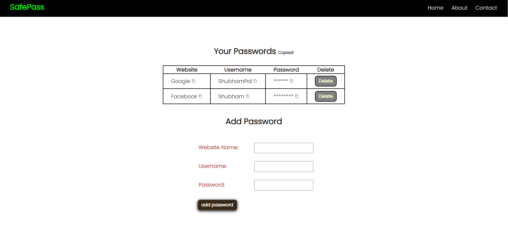

<h1 align="center" id="title">SafePass</h1>

This uses your browsers local storage to store website name user name and password.

<h2>🚀 Demo</h2>

[https://shubhampal31.github.io/password-manager/](https://shubhampal31.github.io/password-manager/)

<h2>Project Screenshots:</h2>

  
  
<h2>💻 Built with</h2>

Technologies used in the project:

*   
*   
*   
